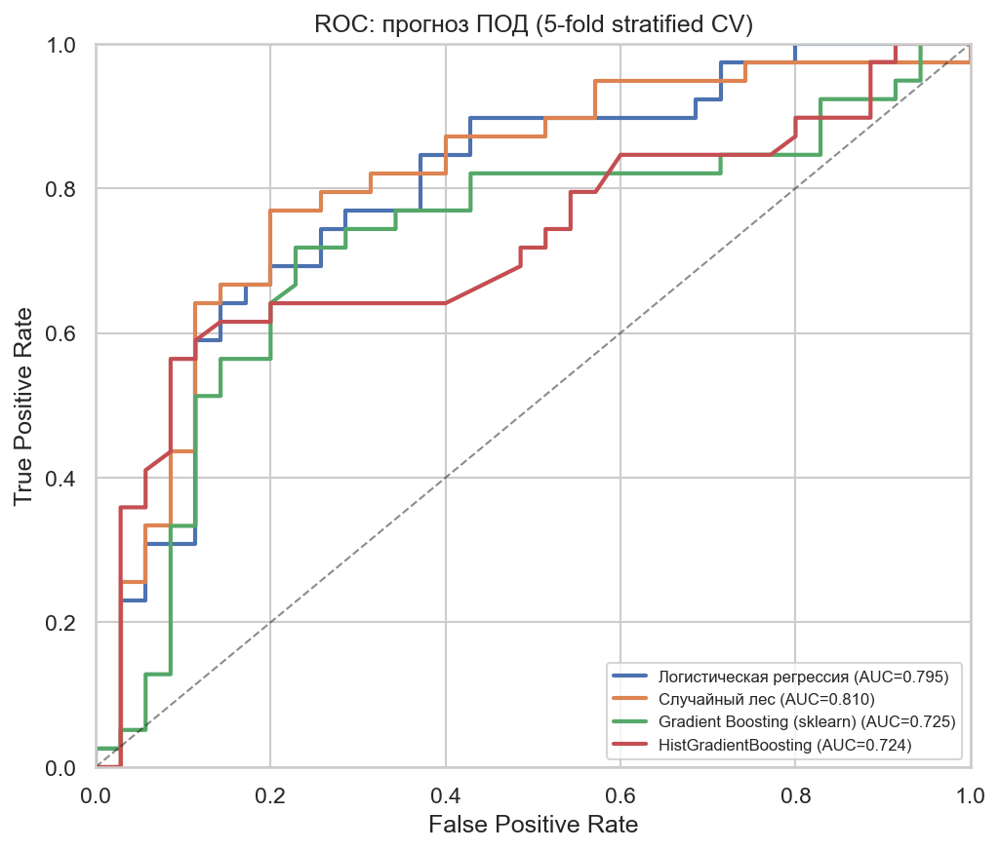
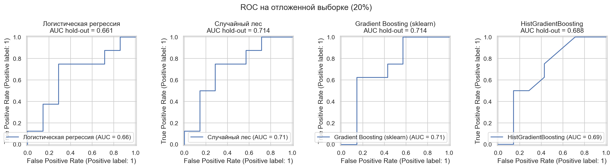
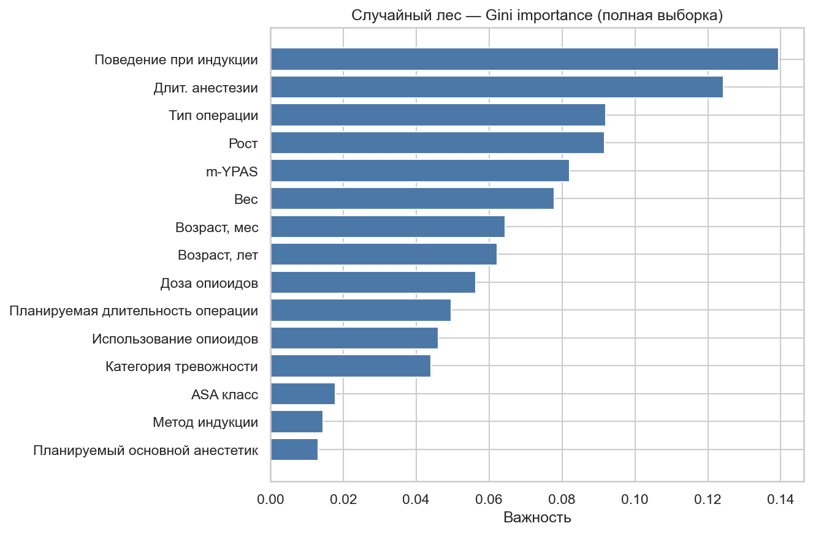

# ПРОДЕТИ_РИСК — сводка PoC

Proof-of-concept прогнозирования **послеоперационного делирия (ПОД)** у детей на данных многоцентрового исследования «ПРОДЕТИ_РИСК».

## Данные

| Параметр | Значение |
|----------|----------|
| Источник | `База_Многоцентровое_исследование_«ПРОДЕТИ_РИСК»_копия.xlsx` |
| Наблюдений с исходом | 74 |
| Доля ПОД | ~52.7% (39 да / 35 нет) |
| Признаков | 24 (клинические + интраоперационные, **без PACU**) |

Шкалы PAED/FLACC и витальные в PACU **не использовались** в модели — они измеряются после пробуждения и дают утечку целевой переменной при прогностической задаче «до делирия».

---

## Сравнение моделей

Оценка на одних и тех же признаках: имputation медианой, **стратифицированная 5-fold CV** (основная метрика) и **hold-out 80/20** (иллюстрация; на малой выборке метрика нестабильна).

| Модель | AUC (5-fold CV) | AUC (hold-out 20%) |
|--------|-----------------|---------------------|
| **Случайный лес** | **0.810** | **0.714** |
| Логистическая регрессия | 0.795 | 0.661 |
| Gradient Boosting (sklearn) | 0.725 | 0.714 |
| HistGradientBoosting (sklearn) | 0.724 | 0.688 |
| XGBoost | — | — |

**XGBoost:** в окружении PoC не запускался (на macOS нужен `brew install libomp`). При необходимости добавьте в venv: `pip install xgboost` и перезапустите `scripts/model_comparison_report.py` или ячейки notebook.

**Вывод:** по CV лучший результат у **случайного леса**; на hold-out RF и Gradient Boosting совпали (0.714), логистическая регрессия ниже. В продакшен-API оставлен **Random Forest** (баланс качества и интерпретируемости).

Повторная генерация метрик и графиков:

```bash
python3 -m venv .venv && .venv/bin/pip install -r requirements.txt
.venv/bin/python scripts/model_comparison_report.py
```

---

## ROC-кривые

В notebook (`pod_delirium_poc.ipynb`, §4–5) и в каталоге `reports/`:

| График | Файл | Описание |
|--------|------|----------|
| ROC, кросс-валидация | `reports/roc_cv.png` | Все модели на одном графике, AUC по out-of-fold предсказаниям |
| ROC, hold-out | `reports/roc_holdout.png` | Отложенная 20% выборка, отдельная панель на модель |





---

## Важность признаков (Feature Importance)

Оценка по **Gini importance** случайного леса и по importance **Gradient Boosting** (модели на полной выборке n=74).

| График | Файл |
|--------|------|
| Случайный лес | `reports/feature_importance_rf.png` |
| Gradient Boosting | `reports/feature_importance_gb.png` |



### Топ признаков (Random Forest, ~67% суммарной важности у топ-7)

| № | Показатель | Доля |
|---|------------|------|
| 1 | **Поведение при индукции** | **13.9%** |
| 2 | **Длительность анестезии, мин** | **12.4%** |
| 3 | **Тип операции** | 9.2% |
| 4 | **Рост, см** | 9.2% |
| 5 | **m-YPAS, %** | 8.2% |
| 6 | **Вес, кг** | 7.8% |
| 7 | **Возраст** (мес / годы) | ~6% каждый |

**Клинический смысл (ориентировочно):** сильнее других на риск ПОД в модели влияют более выраженное беспокойство при индукции, более длительная анестезия, тип операции, антропометрия, возраст и предоперационная тревожность (m-YPAS).

### Умеренная важность

| Показатель | Доля |
|------------|------|
| Доза опиоидов, мкг/кг | 5.6% |
| Планируемая длительность операции | 5.0% |
| Использование опиоидов | ~4–5% |
| Категория тревожности | ~4% |
| ASA, метод индукции, анестетик | <2% |

### Минимальный вклад в модели (~0%)

- Интраоперационные осложнения  
- Дексмедетомидин и доза  
- Негативный прошлый опыт анестезии  
- Премедикация  
- Неврологическая / психиатрическая коморбидность  

---

## Согласованность с логистической регрессией

По стандартизованным коэффициентам логистической регрессии наиболее сильные ассоциации с исходом:

1. Поведение при индукции  
2. Длительность анестезии  
3. Тип коморбидности  
4. ASA  
5. Тип операции  

Направления связи согласуются с доминирующими факторами в случайном лесе; ранжирование может отличаться из-за линейной природы LR и малой выборки.

---

## Ограничения

- **Малый объём выборки** (n = 74) — AUC и важность признаков нестабильны, возможно переобучение; hold-out особенно шумный.  
- **Один центр** в доступных данных (АРДКБ).  
- **PoC**, не клиническая рекомендация — нужна внешняя валидация.  
- Пустые поля в веб-приложении заполняются медианой обучающей выборки.

---

## Артефакты и доступ

| Ресурс | Путь / URL |
|--------|------------|
| Notebook (ROC, FI, сравнение моделей) | `pod_delirium_poc.ipynb` |
| Метрики (JSON) | `reports/model_metrics.json` |
| Модель API | `api/artifacts/model.joblib` |
| Скрипт отчёта | `scripts/model_comparison_report.py` |
| Веб + API (локально) | http://localhost:8080 |
| Деплой Timeweb | https://anzorbagirokov1989-cyber-podapp-8ccd.twc1.net |

См. также `README.md` для запуска и разработки.
